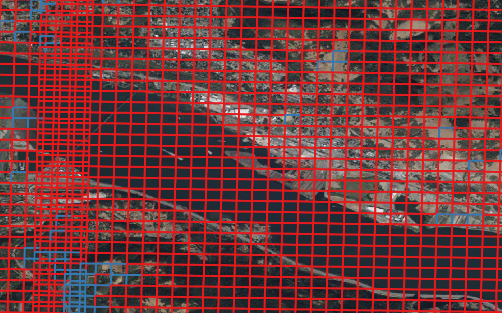

# "Find me all the log yards in Europe"
It started with that challenge from Gert-Jan Nabuurs:
[text](https://www.linkedin.com/posts/gert-jan-nabuurs-803b091b_find-me-all-the-log-yards-in-europe-activity-7312359640799850497-z1C0?utm_source=share&utm_medium=member_desktop&rcm=ACoAACjuRFYBp6OXU-RU6sAZGFKpdcPGZUuLplQ)

This is exactly the kind of thing which should be possible via pre computed satellite image embeddings. As I've wanted to deep dive on such embeddings for a while, I decided to explore this challenge of identifying log yards.

## Outcome
Successfully demonstrated that log yards can be identified using pre-computed embeddings on high resolution (NAIP) imagery. Cosine similiarity is a good first step but imperfect. A simple ML classifier on top of the embeddings, with carefully but easily/quickly gathered labels is most promising for broad use.

## Objective
Use pre-computed EO embeddings from an EO foundational model to identify log yards across a large geography with minimal labels.

## Approach
Given no very high resolution open data is available in Europe, but is in the US (see below), use embeddings from the Clay EO foundational model on NAIP imagery to identify log yards in part of the USA.

## Data and pre-computed embeddings
Log yards are likely easily identifable very high resolution imagery (satellite or aerial), so using embeddings on such imagery is a good place to start. Fortunately in the US NAIP imagery is available at <1m resolution. Further, NAIP has already been processed to embeddings with the Clay EO foundational model. That lets us avoid any heavy processing ourselves and focus just on the key question of identifying log yards based on such embeddings. Unfortunately nothing like NAIP, or embeddings based on it are available in the EU, so this project is a proof of concept on identifying log yards from embeddings in general where open data is available.

See here for context: [text](https://www.linkedin.com/pulse/state-ai-eo-bruno-sanchez-andrade-nu%C3%B1o-kogxf/?trackingId=qTleQGHKSiuTk%2FZFiDOhIA%3D%3D)
Data available here: [text](https://source.coop/clay/clay-v1-5-naip-2)

## NAIP embeddings with Clay EO foundational model
The Clay embeddings are `1024` dimensions and are calculated for 256x256 NAIP pixel patches.

## Data access
To download data for a particular state and year, use the following command (example for Washington state in 2021):
```bash
python download_embeddings.py --state wa --year 2021
```

# Experiments

## 1. Simple cosine similarity
The simplest approach is to find a few examples of log yards and then calculate the cosine similarity of all other embeddings to those examples. This is a very simple approach, but should work well if the log yards are sufficiently different from everything else.

### Method
See code in `embedding_serach.ipynb`
* Manually identified 3 log yards in one part of North East washington state with a few embedding patches each.
* Calculated the mean embedding to combine them into a single embedding.
*Calculated the cosine similarity of all other embeddings to that mean embedding for all the NAIP embeddings from Washington state in 2021.
* Ranked the similarity scores, and exported the patch geometries, similarity scores and ranks to a gpkg for visualisation in QGIS.
* Visually insepcted the results in QGIS with Bing Maps base layer to see if the results were reasonable.

### Results
* 8 out of top 10 results were log yards (not counting the 3 used to calculate the mean embedding).
* 1 odd false negative - one of the 3 log yards used to calculate the mean embedding was not in the top 10 similarity results.
* Increasing false positives after the top 10 by similarity.
* False positives often other industrial areas or feed lots

Example detected log yard in Southern Washington state (distant from the examples used to calculate the mean embedding):


Example false positive of a cattle feed lot:


### Interpretation
Cosine similarity weights each embedding position equally. As some positions might be more important than others for our task, its likely that cosine similarity includes a lot of irrelevant information. In embedding space, its entirely possible that there's more variability in terms of cosine similarity between different examples of log yards than between log yards and other land uses. Therefore we need an approach which can learn the relevant features for log yards and ignore the irrelevant ones - i.e. Machine Learning.

## 2. Simple ML Classifier
Try a simple ML (e.g. Random Forest) classifier to better distinguish in embedding space between log yards and other land uses.

### Method
Code for experiments 2-5 is in `embedding_modelling.ipynb`
* Collected total of 11 log yard examples with multiple patches from each based on discovering them in top 20 cosine similarity results from experiment 1.
* Collected 9 false positives (industrial yards, cattle feed lots, etc.) and surrounding tiles from the top 20 cosine similarity results from experiment 1.
* Used embeddings from these positive and negative examples to train a binary random forest classifier.
* Ran classifier on all embeddings from Washington state in 2021.
* Exported the results to a gpkg for visualisation in QGIS.

### Results
* 100% accuracy on training and holdout validation sets.
* Catastophic false positives on the entire state of Washington.

Example extreme number of false positives (red = classified as log yards, blue = classified as not log yards):



### Interpretation
The labels used to train the classifier only represented a very small region of the embedding space: the region within and adjacent to embeddings for log yards. However, this is a very small part of the entire embedding space. Therefore when used *out of distribution* on the majority of patches, it performed incredibly badly despite having 100% validation accuracy.

Two possible solutions:
1. Add representative negative samples to the training set.
2. Use cosine similarity to filter the embeddings before applying the classifier. This should remove most of the false positives, as the classifier is then only applied to embeddings which are similar to log yards.


## 3. Add cosine similarity along with classifier prediction
Many false positives from previous experiment were associated with very low cosine similarity scores from experiment 1. Therefore, can we combine cosine similarity and a classifier: the cosine similiarty provides candidates, and the classifier does the more difficult distinction of hard to separate candidates.

### Method
Code for experiments 2-5 is in `embedding_modelling.ipynb`
* Calculate mean embedding from the log yards used in experiment 2 (11, not 3 from 1st experiment).
* Calculate cosine similarity of all embeddings from Washington state in 2021 to that mean embedding.
* Export the cosine similarity AND classifier predictions from experiment 2 to a gpkg for visualisation in QGIS.

### Results
* Cosine similarity scores were very low for all embeddings, even for the log yards used to calculate the mean embedding.
* Little distinction in cosine similarity scores between log yards and other similar industrial land uses.

Example of low cosine similarity scores for log yards (all rectangles = classifier returned "log yard", blue indicates similarity score > 0.1):


Example of false positives on other industrial sites with similar cosine simliarity to log yards:


### Interpretation
The low similarity scores are likely because taking the mean embedding of more numerous and more diverse log yards put the mean embedding in a very different and likely unrealistic part of the embedding space. For example, some log yard patches include water, and taking means of embeddings with and without water may create unrealistic embeddings for similarity search. To make the approach work, we'd have to either create a more representative log yard embedding, or calculate multiple similarities (e.g. vs all log yard examples) and take the maximum similiarity score.

## 4. Add random negative samples to dataset
As log yards are rare, randomly sampling e.g. 0.1% of patches from the entire state of Washington should give a good representation of the negative class. Try this approach before investigating alternative ways to combine embeddings.

### Method
Code for experiments 2-5 is in `embedding_modelling.ipynb`
* Sampled 0.1% of all patches from the entire state of Washington in 2021 and assigned (assumed) negative labels.
* Added these random samples to the training set and retrained the classifier.
* Ran classifier on all embeddings from Washington state in 2021.
* Exported the results to a gpkg for visualisation in QGIS.

### Results
* Much better performance than previous experiments, but still abundant false positives on other industrial land uses.
* False positives largely aren't those we labelled in experiment 2 (quarries, feed lots, etc.)

Example of abundant false positives on other industrial sites:


### Interpretation
As the false positives are not the same as those labelled in experiment 2, but are quite similar land classes, and not so common as to be well represented by random sampling, this result is not unexpected. Therefore we likely simply need to add more of these false negatives to the training set.

## 5. Add manually selected negatives from step 4 false positives
Classic active learning/human in the loop - manually annotate/correct missclassified samples from previous step.

## Method
Code for experiments 2-5 is in `embedding_modelling.ipynb`
* Manually select a few dozen groups of false positive miss classified regions from the previous step. (False negative are hard to find so weren't included)
* Add these to the training, and retrain the classifier.
* Run classifier on all embeddings from Washington state in 2021 AND Oregon state in 2020 and export to gpkg.

### Results
* Analyse Oregon results only as stronger test of performance.
* Manually reviewed the 164 patches/patch groups classified as log yards.
* 59% of these were actually log yards (precision), 41% were false positives.
* Majority of false positives were quarries or aggregate/bulk mineral yards (industrial sites with big piles of stuff)
* True recall performance not known due to lack of ground truth.

All examples from Oregon (training data only from Washington):
Example of a true positive and false negative:


Example of true positives in Oregon:


Example of quarry false positive:


Example of bulk mineral yard false positive:


### Interpretation/Analysis
* Clearly adding focused negative samples improved the classifier significantly. Performance is reasonably good for such a rare classes.
* Additional focused data labelling likely to improve the classifier further.
* Further labelling should focus on the most common false positives (quarries, bulk mineral yards, etc.).


## Conclusion
* Cosine similarity is a quick and easy first step, but includes false positives and is unbounded (i.e. you can rank most similar, but there's no binary classification, just increasing false positives as you go down the ranking).
* Simple ML classifier (e.g. Random Forest) is a good next step but requires genuinely representative negative samples to work effectively.
* Cosine similarity itself was a good way to identify positive labels for the ML classifier training.
* Iterative/active learning was an effective way to improve classifier performance - at each step, gather false positive examples and add them to the training set until performance is acceptable.